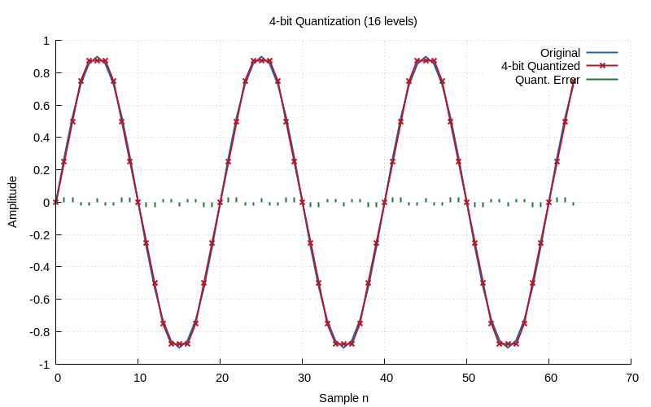
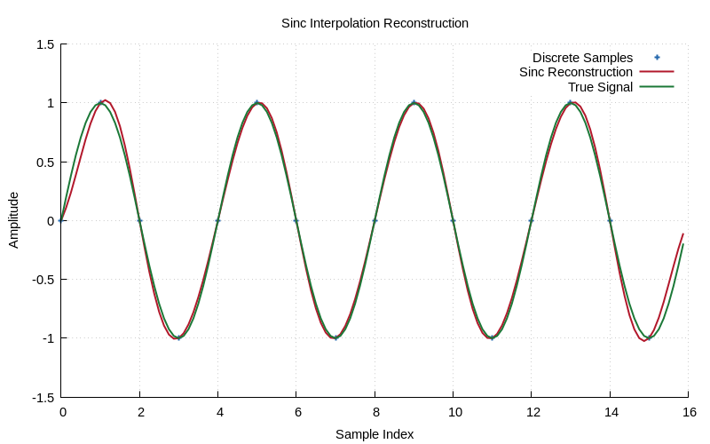

# Chapter 2: Sampling, Aliasing & Nyquist

Sampling theorem, aliasing effects, and reconstruction.

## Contents

| File | Description |
|------|------------|
| [tutorial.md](tutorial.md) | Full theory tutorial with equations and exercises |
| [demo.c](demo.c) | Self-contained runnable demo |

## Generated Plots

---

[← Ch 1](../01-signals-and-sequences/README.md) | [Index](../../reference/CHAPTER_INDEX.md) | [Ch 3 →](../03-complex-numbers/README.md)
