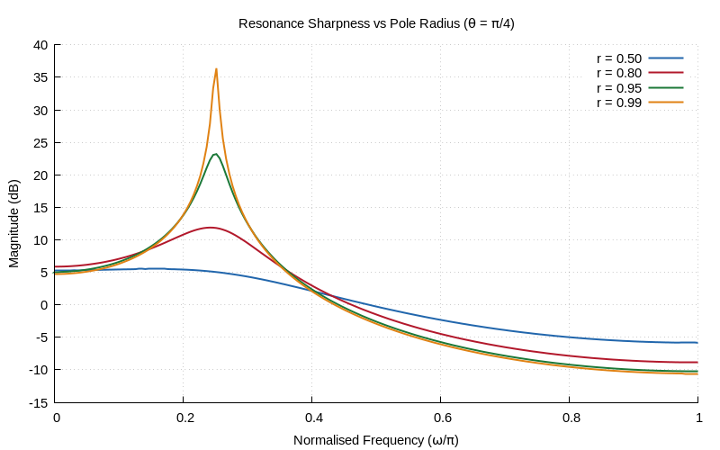

# Chapter 5: The Z-Transform

Z-transform definition, properties, ROC, and pole-zero analysis.

## Contents

| File | Description |
|------|------------|
| [tutorial.md](tutorial.md) | Full theory tutorial with equations and exercises |
| [demo.c](demo.c) | Self-contained runnable demo |

## Generated Plots

---

[← Ch 4](../04-lti-systems/README.md) | [Index](../../reference/CHAPTER_INDEX.md) | [Ch 6 →](../06-frequency-response/README.md)
