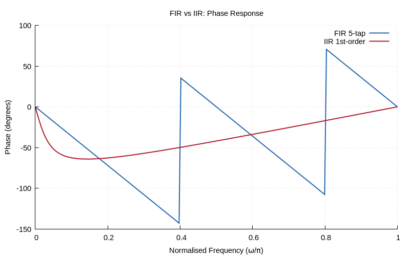
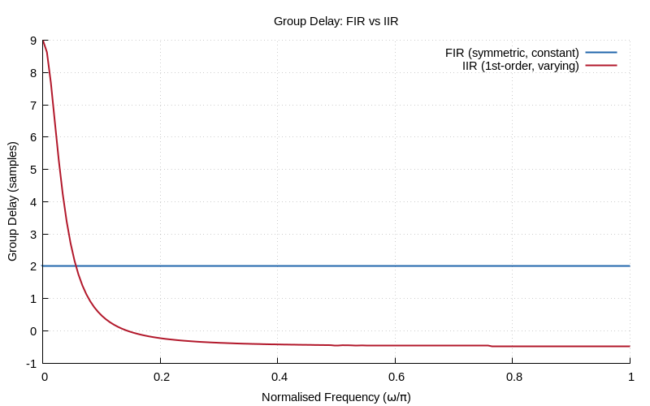
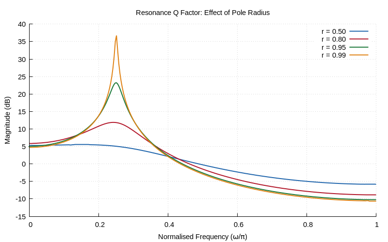

# Chapter 6: Frequency Response, Poles & Zeros

Magnitude/phase response from pole-zero placement.

## Contents

| File | Description |
|------|------------|
| [tutorial.md](tutorial.md) | Full theory tutorial with equations and exercises |
| [demo.c](demo.c) | Self-contained runnable demo |
| [`iir.h`](../../include/iir.h) | Library API |

## Generated Plots

---

[← Ch 5](../05-z-transform/README.md) | [Index](../../reference/CHAPTER_INDEX.md) | [Ch 7 →](../07-dft-theory/README.md)
