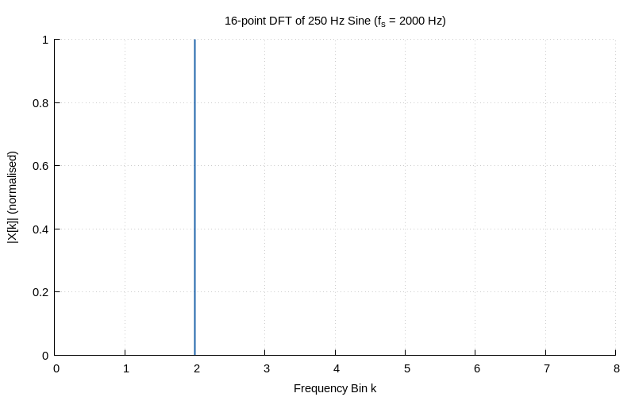
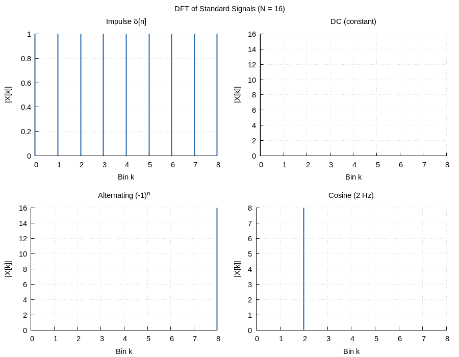
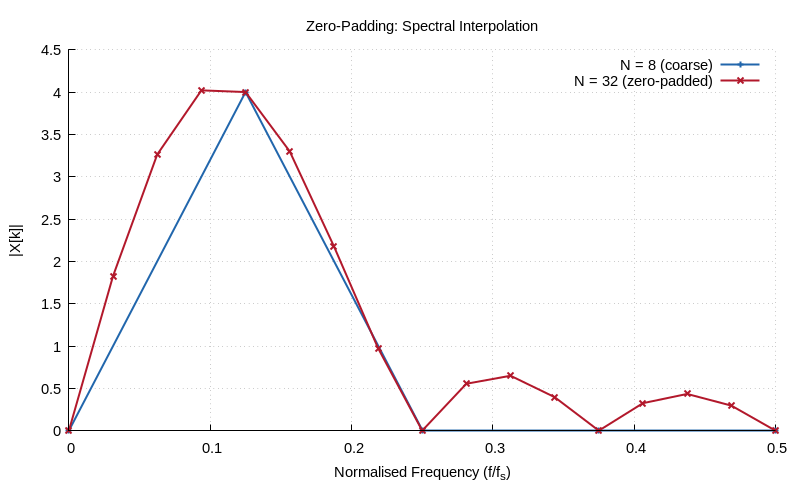

# Chapter 7: The DFT — Theory & Properties

Discrete Fourier Transform definition, properties, and interpretation.

## Contents

| File | Description |
|------|------------|
| [tutorial.md](tutorial.md) | Full theory tutorial with equations and exercises |
| [demo.c](demo.c) | Self-contained runnable demo |

## Generated Plots

---

[← Ch 6](../06-frequency-response/README.md) | [Index](../../reference/CHAPTER_INDEX.md) | [Ch 8 →](../08-fft-fundamentals/README.md)
