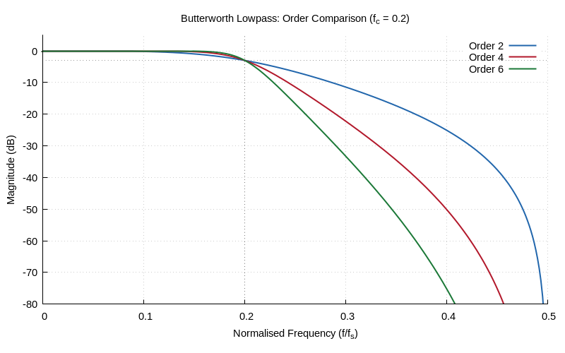

# Chapter 11: IIR Filter Design

Butterworth and Chebyshev IIR filter design.

## Contents

| File | Description |
|------|------------|
| [tutorial.md](tutorial.md) | Full theory tutorial with equations and exercises |
| [demo.c](demo.c) | Self-contained runnable demo |
| [`iir.h`](../../include/iir.h) | Library API |

## Generated Plots

---

[← Ch 10](../10-digital-filters/README.md) | [Index](../../reference/CHAPTER_INDEX.md) | [Ch 12 →](../12-filter-structures/README.md)
