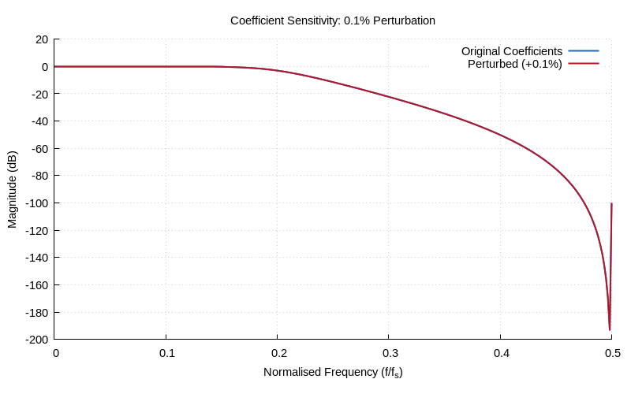

# Chapter 12: Filter Structures

Direct-Form I/II, biquad cascades, and SOS structures.

## Contents

| File | Description |
|------|------------|
| [tutorial.md](tutorial.md) | Full theory tutorial with equations and exercises |
| [demo.c](demo.c) | Self-contained runnable demo |

## Generated Plots

---

[← Ch 11](../11-iir-filter-design/README.md) | [Index](../../reference/CHAPTER_INDEX.md) | [Ch 13 →](../13-spectral-analysis/README.md)
