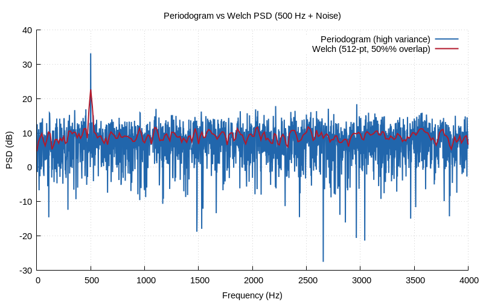

# Chapter 14: PSD & Welch's Method

Power spectral density estimation using Welch's method.

## Contents

| File | Description |
|------|------------|
| [tutorial.md](tutorial.md) | Full theory tutorial with equations and exercises |
| [demo.c](demo.c) | Self-contained runnable demo |
| [`spectrum.h`](../../include/spectrum.h) | Library API |

## Generated Plots

---

[← Ch 13](../13-spectral-analysis/README.md) | [Index](../../reference/CHAPTER_INDEX.md) | [Ch 15 →](../15-correlation/README.md)
