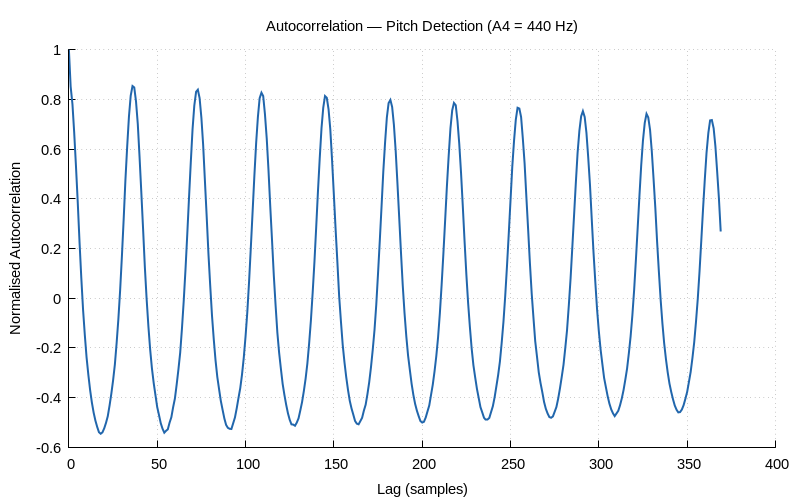
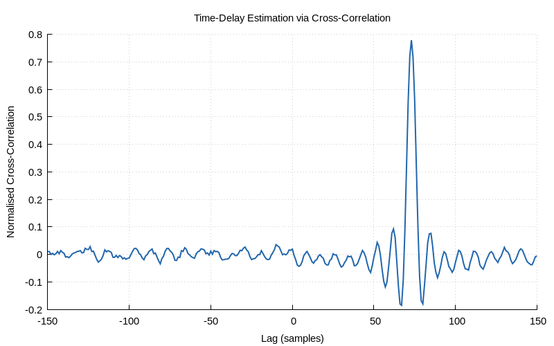

# Chapter 15: Correlation & Autocorrelation

Cross-correlation, autocorrelation, and pitch detection.

## Contents

| File | Description |
|------|------------|
| [tutorial.md](tutorial.md) | Full theory tutorial with equations and exercises |
| [demo.c](demo.c) | Self-contained runnable demo |
| [`correlation.h`](../../include/correlation.h) | Library API |

## Generated Plots

---

[← Ch 14](../14-psd-welch/README.md) | [Index](../../reference/CHAPTER_INDEX.md) | [Ch 16 →](../16-overlap-add-save/README.md)
