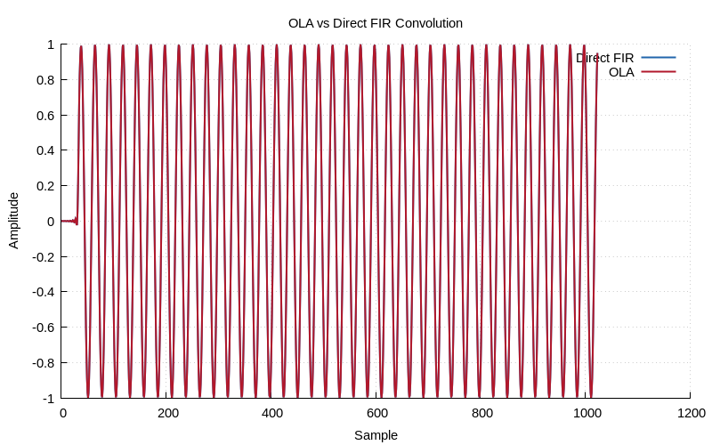
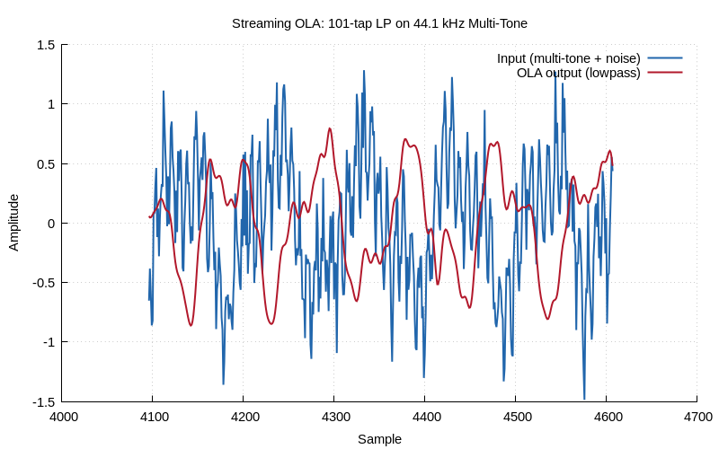

# Chapter 16: Overlap-Add/Save Streaming

Block-based FFT convolution for streaming.

## Contents

| File | Description |
|------|------------|
| [tutorial.md](tutorial.md) | Full theory tutorial with equations and exercises |
| [demo.c](demo.c) | Self-contained runnable demo |
| [`streaming.h`](../../include/streaming.h) | Library API |

## Generated Plots

---

[← Ch 15](../15-correlation/README.md) | [Index](../../reference/CHAPTER_INDEX.md) | [Ch 17 →](../17-multirate-dsp/README.md)
