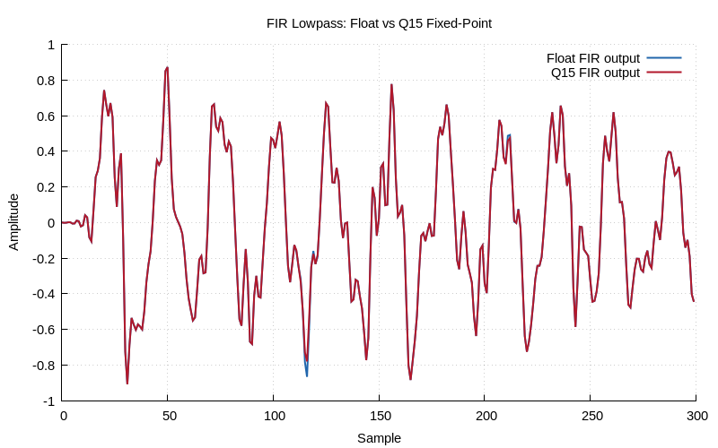

# Chapter 18: Fixed-Point Arithmetic

Q15/Q31 formats, SQNR, and fixed-point FIR.

## Contents

| File | Description |
|------|------------|
| [tutorial.md](tutorial.md) | Full theory tutorial with equations and exercises |
| [demo.c](demo.c) | Self-contained runnable demo |
| [`fixed_point.h`](../../include/fixed_point.h) | Library API |

## Generated Plots

---

[← Ch 17](../17-multirate-dsp/README.md) | [Index](../../reference/CHAPTER_INDEX.md) | [Ch 19 →](../19-advanced-fft/README.md)
