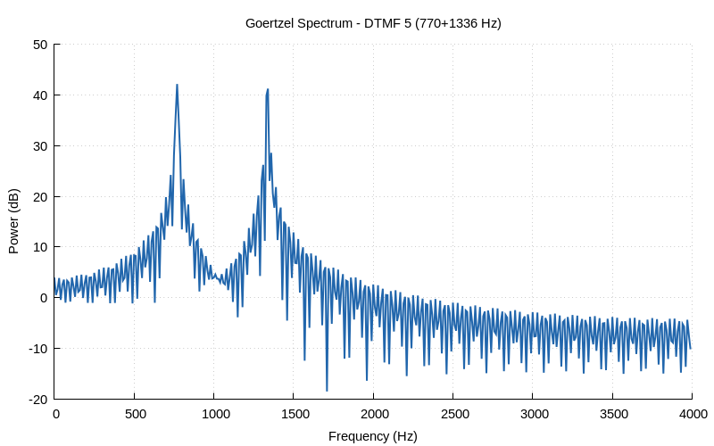

# Chapter 19: Advanced FFT Techniques

Goertzel algorithm, DTMF detection, and sliding DFT.

## Contents

| File | Description |
|------|------------|
| [tutorial.md](tutorial.md) | Full theory tutorial with equations and exercises |
| [demo.c](demo.c) | Self-contained runnable demo |
| [`advanced_fft.h`](../../include/advanced_fft.h) | Library API |

## Generated Plots

---

[← Ch 18](../18-fixed-point/README.md) | [Index](../../reference/CHAPTER_INDEX.md) | [Ch 20 →](../20-hilbert-transform/README.md)
