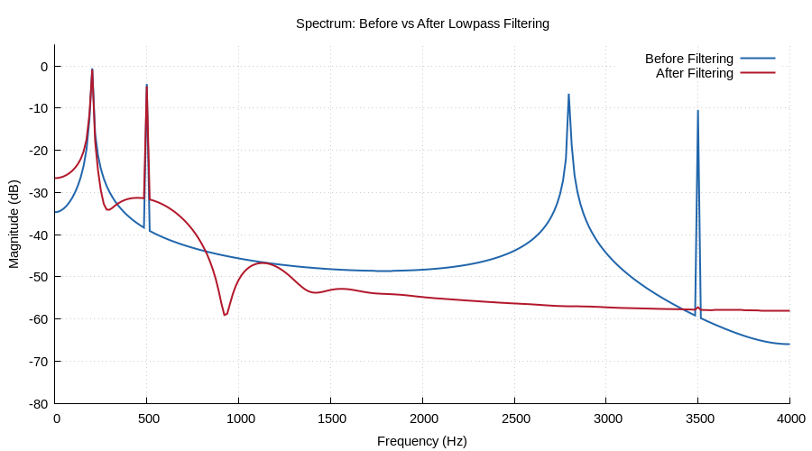

# Chapter 30: End-to-End Capstone

Comprehensive pipeline exercising 13 library modules across all 7 phases.

## Contents

| File | Description |
|------|------------|
| [tutorial.md](tutorial.md) | Full theory tutorial with equations and exercises |
| [demo.c](demo.c) | Self-contained runnable demo |

## Generated Plots

---

[← Ch 29](../29-optimisation/README.md) | [Index](../../reference/CHAPTER_INDEX.md)
