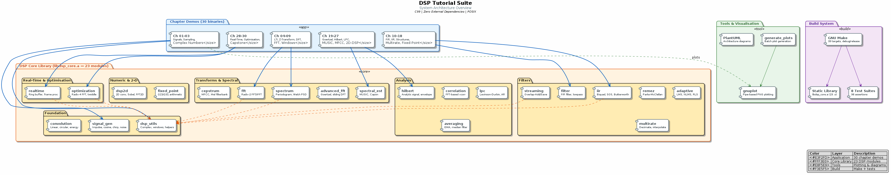
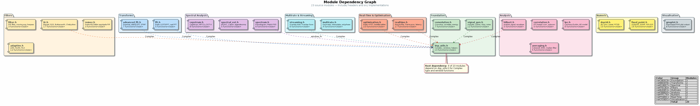
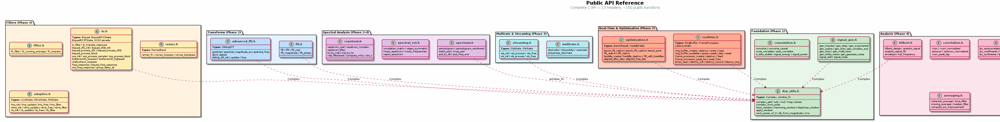
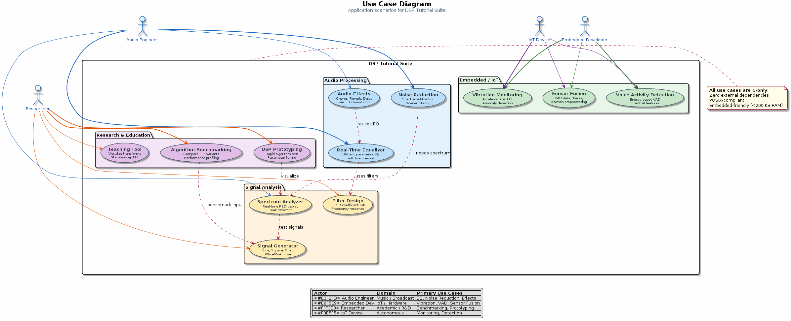

# DSP Tutorial Suite: Visual Documentation

PlantUML diagrams for the DSP Tutorial Suite project. Diagrams are split between
this common directory and individual chapter folders (co-located where chapter-specific).

## Common Diagrams (this directory)

| Diagram | Source | Description |
|---------|--------|-------------|
|  | [architecture.puml](architecture.puml) | System architecture — 4-layer overview (demos, library, tools, build) |
|  | [modules.puml](modules.puml) | Module dependency graph — all 23 headers with dependency arrows |
|  | [api_reference.puml](api_reference.puml) | Public API reference — ~150 functions across 23 headers |
|  | [use_cases.puml](use_cases.puml) | Primary use cases — audio, embedded, research applications |

## Chapter-Specific Diagrams (co-located)

| Diagram | Location | Description |
|---------|----------|-------------|
| FFT Sequence | [chapters/08-fft-fundamentals/](../../chapters/08-fft-fundamentals/) | Cooley-Tukey butterfly call flow |
| Signal Flow | [chapters/13-spectral-analysis/](../../chapters/13-spectral-analysis/) | Time→frequency domain pipeline |
| Real-Time Architecture | [chapters/28-real-time-streaming/](../../chapters/28-real-time-streaming/) | Ring buffer streaming pipeline |
| Optimisation Roadmap | [chapters/29-optimisation/](../../chapters/29-optimisation/) | Multi-stage optimisation strategy |

## Rendering

### VS Code Extension
```bash
code --install-extension jebbs.plantuml
```
Open any `.puml` file and press `Alt+D` to preview.

### Command Line
```bash
# Render common diagrams
java -jar ~/tools/plantuml.jar -tpng reference/diagrams/*.puml

# Render chapter-specific diagrams
for f in chapters/*//*.puml; do
  java -jar ~/tools/plantuml.jar -tpng "$f"
done
```

### Automated Script
```bash
./reference/diagrams/render_diagrams.sh
```

## Updating Diagrams

1. Edit the `.puml` source
2. Regenerate PNG with PlantUML
3. Commit both `.puml` and `.png` files

---

**Note**: All `.png` files are generated from `.puml` sources.
Edit the `.puml` files directly; regenerate PNG on changes.
